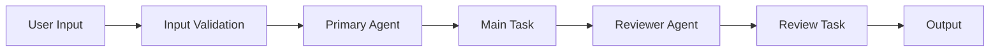

# CrewAI Project Template

A comprehensive template guide for creating production-ready CrewAI projects based on the Socratic Sofa architecture.

## Quick Start

```bash
# Create new project
mkdir my-crew-project && cd my-crew-project

# Initialize with uv
uv init
uv add crewai[tools] anthropic gradio pyyaml ratelimit

# Create structure
mkdir -p src/my_crew/{config} tests docs/{api,architecture,user-guide}
touch src/my_crew/{__init__.py,crew.py,main.py,gradio_app.py}
touch src/my_crew/config/{agents.yaml,tasks.yaml}
```

---

## Project Structure

```
my-crew-project/
├── src/my_crew/                    # Main application
│   ├── __init__.py
│   ├── crew.py                     # CrewAI orchestration
│   ├── main.py                     # CLI entry points
│   ├── gradio_app.py               # Web interface
│   ├── schemas.py                  # Pydantic output models
│   ├── content_filter.py           # Safety/moderation (optional)
│   ├── logging_config.py           # Structured logging
│   ├── rate_limiter.py             # API throttling
│   └── config/
│       ├── agents.yaml             # Agent definitions
│       └── tasks.yaml              # Task definitions
│
├── tests/                          # Test suite
│   ├── __init__.py
│   ├── conftest.py                 # Shared fixtures
│   ├── test_crew.py
│   ├── test_main.py
│   └── test_gradio_app.py
│
├── docs/                           # Documentation
│   ├── README.md
│   ├── CHANGELOG.md
│   ├── api/
│   ├── architecture/
│   └── user-guide/
│
├── .github/workflows/              # CI/CD
│   └── ci.yml
│
├── pyproject.toml                  # Project config
├── Makefile                        # Dev commands
├── .pre-commit-config.yaml         # Quality hooks
├── .env.example                    # Environment template
├── README.md
└── LICENSE
```

---

## Core Files

### 1. crew.py - CrewAI Orchestration

```python
"""
My Crew - Multi-agent orchestration system
"""

from crewai import Agent, Crew, Process, Task
from crewai.project import CrewBase, agent, crew, task


@CrewBase
class MyCrew:
    """Main crew orchestration class."""

    agents_config = "config/agents.yaml"
    tasks_config = "config/tasks.yaml"

    # Optional callback for streaming progress
    task_callback = None

    @agent
    def primary_agent(self) -> Agent:
        """Primary agent for main operations."""
        return Agent(
            config=self.agents_config["primary_agent"],
            verbose=True,
        )

    @agent
    def reviewer_agent(self) -> Agent:
        """Reviewer agent for quality checks."""
        return Agent(
            config=self.agents_config["reviewer_agent"],
            verbose=True,
        )

    @task
    def main_task(self) -> Task:
        """Primary task execution."""
        return Task(
            config=self.tasks_config["main_task"],
        )

    @task
    def review_task(self) -> Task:
        """Review and validate output."""
        return Task(
            config=self.tasks_config["review_task"],
            context=[self.main_task()],  # Chain context
        )

    @crew
    def crew(self) -> Crew:
        """Create and configure the crew."""
        return Crew(
            agents=self.agents,
            tasks=self.tasks,
            process=Process.sequential,
            verbose=True,
            task_callback=self.task_callback,
        )
```

### 2. config/agents.yaml - Agent Definitions

```yaml
primary_agent:
  role: "Domain Expert"
  goal: "Accomplish the primary task with expertise and precision"
  backstory: |
    You are an expert in [domain]. Your approach:

    1. Analyze the input thoroughly
    2. Apply domain-specific knowledge
    3. Produce high-quality output
    4. Follow established best practices

    Core principles:
    - Accuracy over speed
    - Clear communication
    - Evidence-based reasoning

reviewer_agent:
  role: "Quality Reviewer"
  goal: "Ensure output meets quality standards"
  backstory: |
    You are a meticulous reviewer who:

    1. Checks for completeness
    2. Validates accuracy
    3. Ensures consistency
    4. Provides constructive feedback

    Evaluation criteria:
    - Correctness: 40%
    - Clarity: 30%
    - Completeness: 20%
    - Style: 10%
```

### 3. config/tasks.yaml - Task Definitions

```yaml
main_task:
  description: |
    Execute the primary task with the following input:

    Input: {user_input}
    Context: {context}

    Requirements:
    1. [Requirement 1]
    2. [Requirement 2]
    3. [Requirement 3]

    Output format:
    - Use clear headings
    - Include examples where helpful
    - Be concise but thorough
  expected_output: |
    A comprehensive response that:
    - Addresses all requirements
    - Is well-structured
    - Includes actionable insights
  agent: primary_agent

review_task:
  description: |
    Review the output from the main task.

    Evaluate against these criteria:
    - Correctness (40%)
    - Clarity (30%)
    - Completeness (20%)
    - Style (10%)

    Provide:
    1. Overall score (1-10)
    2. Strengths
    3. Areas for improvement
    4. Final recommendation
  expected_output: |
    ## Review Summary

    **Score**: X/10

    ### Strengths
    - [Strength 1]

    ### Improvements
    - [Improvement 1]

    ### Recommendation
    [Final assessment]
  agent: reviewer_agent
  context:
    - main_task
```

### 4. main.py - CLI Entry Points

```python
#!/usr/bin/env python
"""CLI entry points for the crew."""

import sys
from datetime import datetime

from my_crew.crew import MyCrew


def run():
    """Run the crew with user input."""
    inputs = {
        "user_input": sys.argv[1] if len(sys.argv) > 1 else "default input",
        "context": "Additional context here",
        "current_year": str(datetime.now().year),
    }

    crew = MyCrew()
    result = crew.crew().kickoff(inputs=inputs)

    print("\n" + "=" * 60)
    print("FINAL OUTPUT")
    print("=" * 60)
    print(result.raw)

    return result


def train():
    """Train the crew for n iterations."""
    inputs = {"user_input": "training input"}
    MyCrew().crew().train(
        n_iterations=int(sys.argv[1]) if len(sys.argv) > 1 else 5,
        filename=sys.argv[2] if len(sys.argv) > 2 else "training_data.pkl",
        inputs=inputs,
    )


def replay():
    """Replay a specific task from training."""
    MyCrew().crew().replay(task_id=sys.argv[1] if len(sys.argv) > 1 else "")


def test():
    """Test the crew execution."""
    inputs = {"user_input": "test input"}
    MyCrew().crew().test(
        n_iterations=int(sys.argv[1]) if len(sys.argv) > 1 else 1,
        openai_model_name="gpt-4o-mini",
        inputs=inputs,
    )


if __name__ == "__main__":
    run()
```

### 5. schemas.py - Pydantic Output Models

```python
"""Pydantic models for structured crew output."""

from pydantic import BaseModel, Field


class TaskOutput(BaseModel):
    """Base output for any task."""

    title: str = Field(description="Output title")
    content: str = Field(description="Main content")
    confidence: float = Field(ge=0, le=1, description="Confidence score")


class ReviewOutput(BaseModel):
    """Structured review output."""

    score: int = Field(ge=1, le=10, description="Overall score")
    strengths: list[str] = Field(description="List of strengths")
    improvements: list[str] = Field(description="Areas for improvement")
    recommendation: str = Field(description="Final recommendation")


def format_task_output(output: TaskOutput) -> str:
    """Format task output as markdown."""
    return f"""## {output.title}

{output.content}

*Confidence: {output.confidence:.0%}*
"""


def format_review_output(output: ReviewOutput) -> str:
    """Format review output as markdown."""
    strengths = "\n".join(f"- {s}" for s in output.strengths)
    improvements = "\n".join(f"- {i}" for i in output.improvements)

    return f"""## Review Summary

**Score**: {output.score}/10

### Strengths
{strengths}

### Areas for Improvement
{improvements}

### Recommendation
{output.recommendation}
"""
```

### 6. gradio_app.py - Web Interface Template

```python
#!/usr/bin/env python
"""Gradio web interface for the crew."""

from datetime import datetime
from queue import Queue
from threading import Thread

import gradio as gr

from my_crew.crew import MyCrew

# Custom CSS
CUSTOM_CSS = """
    :root {
        --primary: #F47D31;
        --secondary: #FF8C69;
        --background: #FFF8F0;
        --text: #5C3D2E;
    }

    .gradio-container {
        background: var(--background) !important;
    }

    button.primary {
        background: linear-gradient(135deg, var(--primary), var(--secondary)) !important;
        border-radius: 50px !important;
    }
"""


def run_crew_streaming(user_input: str):
    """Run crew with streaming output."""
    if not user_input.strip():
        yield "Please enter some input."
        return

    task_queue = Queue()

    def task_callback(output):
        task_queue.put(output)

    inputs = {
        "user_input": user_input,
        "current_year": str(datetime.now().year),
    }

    result_container = {"result": None, "error": None}

    def run_crew():
        try:
            crew_instance = MyCrew()
            crew_instance.task_callback = task_callback
            result_container["result"] = crew_instance.crew().kickoff(inputs=inputs)
        except Exception as e:
            result_container["error"] = e

    thread = Thread(target=run_crew)
    thread.start()

    output = "Processing...\n\n"
    yield output

    while thread.is_alive() or not task_queue.empty():
        try:
            task_output = task_queue.get(timeout=0.5)
            output += f"\n---\n\n{task_output.raw}\n\n"
            yield output
        except Exception:
            pass

    thread.join()

    if result_container["error"]:
        yield f"Error: {result_container['error']}"


# Build interface
with gr.Blocks(title="My Crew") as demo:
    gr.Markdown("# My Crew Application")

    with gr.Row():
        input_box = gr.Textbox(
            label="Input",
            placeholder="Enter your request...",
            lines=3,
        )

    run_btn = gr.Button("Run", variant="primary")

    output_box = gr.Markdown(label="Output")

    run_btn.click(
        fn=run_crew_streaming,
        inputs=[input_box],
        outputs=[output_box],
    )


def main():
    """Launch the web interface."""
    demo.launch(
        server_name="0.0.0.0",
        server_port=7860,
        css=CUSTOM_CSS,
        theme=gr.themes.Soft(primary_hue="orange"),
    )


if __name__ == "__main__":
    main()
```

---

## Configuration Files

### pyproject.toml

```toml
[project]
name = "my-crew"
version = "0.1.0"
description = "Multi-agent system powered by CrewAI"
readme = "README.md"
requires-python = ">=3.11"
license = { text = "MIT" }

dependencies = [
    "crewai[tools]>=1.7.0",
    "anthropic>=0.75.0",
    "gradio>=6.1.0",
    "pyyaml>=6.0.3",
    "ratelimit>=2.2.1",
]

[project.optional-dependencies]
dev = [
    "ruff>=0.8.0",
    "mypy>=1.13.0",
    "bandit>=1.8.0",
    "vulture>=2.14",
    "pre-commit>=4.0.0",
]
test = [
    "pytest>=8.0.0",
    "pytest-cov>=4.0.0",
    "pytest-mock>=3.12.0",
]

[project.scripts]
my_crew = "my_crew.main:run"
my_crew_web = "my_crew.gradio_app:main"
train = "my_crew.main:train"
replay = "my_crew.main:replay"
test_crew = "my_crew.main:test"

[build-system]
requires = ["hatchling"]
build-backend = "hatchling.build"

[tool.hatch.build.targets.wheel]
packages = ["src/my_crew"]

[tool.ruff]
line-length = 100
target-version = "py311"

[tool.ruff.lint]
select = ["E", "W", "F", "I", "B", "C4", "UP", "ARG", "SIM", "S", "PTH"]
ignore = ["S101"]

[tool.pytest.ini_options]
testpaths = ["tests"]
addopts = "-v --tb=short"

[tool.coverage.run]
source = ["src/my_crew"]
omit = ["*/tests/*"]

[tool.coverage.report]
fail_under = 80
```

### Makefile

```makefile
.PHONY: help install dev web test lint format security clean

help:
	@echo "Available commands:"
	@echo "  install     - Install dependencies"
	@echo "  dev         - Run CLI version"
	@echo "  web         - Launch web interface"
	@echo "  test        - Run tests"
	@echo "  lint        - Run linter"
	@echo "  format      - Format code"
	@echo "  security    - Security scan"
	@echo "  clean       - Clean caches"

install:
	uv sync

dev:
	uv run my_crew

web:
	uv run my_crew_web

test:
	uv run pytest tests/ -v

test-cov:
	uv run pytest tests/ --cov=src/my_crew --cov-report=term-missing --cov-fail-under=80

lint:
	uv run ruff check src/ tests/

format:
	uv run ruff format src/ tests/
	uv run ruff check --fix src/ tests/

security:
	uv run bandit -r src/ -ll
	detect-secrets scan --baseline .secrets.baseline

typecheck:
	uv run mypy src/

precommit-install:
	uv run pre-commit install

precommit:
	uv run pre-commit run --all-files

clean:
	rm -rf __pycache__ .pytest_cache .mypy_cache .ruff_cache
	find . -type d -name "__pycache__" -exec rm -rf {} + 2>/dev/null || true
```

### .pre-commit-config.yaml

```yaml
repos:
  - repo: https://github.com/astral-sh/ruff-pre-commit
    rev: v0.8.4
    hooks:
      - id: ruff
        args: [--fix]
      - id: ruff-format

  - repo: https://github.com/PyCQA/bandit
    rev: 1.8.0
    hooks:
      - id: bandit
        args: ["-ll", "-r", "src/"]
        exclude: tests/

  - repo: https://github.com/Yelp/detect-secrets
    rev: v1.5.0
    hooks:
      - id: detect-secrets
        args: ["--baseline", ".secrets.baseline"]

  - repo: https://github.com/jendrikseipp/vulture
    rev: v2.14
    hooks:
      - id: vulture
        args: ["src/", "--min-confidence", "80"]

  - repo: https://github.com/pre-commit/pre-commit-hooks
    rev: v5.0.0
    hooks:
      - id: trailing-whitespace
      - id: end-of-file-fixer
      - id: check-yaml
      - id: check-added-large-files
        args: ["--maxkb=500"]
      - id: check-merge-conflict
      - id: detect-private-key
```

### .github/workflows/ci.yml

```yaml
name: CI

on:
  push:
    branches: [main]
  pull_request:
    branches: [main]

jobs:
  quality:
    runs-on: ubuntu-latest
    steps:
      - uses: actions/checkout@v4
      - uses: astral-sh/setup-uv@v4
      - run: uv sync
      - run: uv run ruff check src/ tests/
      - run: uv run ruff format --check src/ tests/

  security:
    runs-on: ubuntu-latest
    steps:
      - uses: actions/checkout@v4
      - uses: astral-sh/setup-uv@v4
      - run: uv sync
      - run: uv run bandit -r src/ -ll
      - run: pip install detect-secrets && detect-secrets scan --baseline .secrets.baseline

  test:
    runs-on: ubuntu-latest
    needs: quality
    env:
      ANTHROPIC_API_KEY: ${{ secrets.ANTHROPIC_API_KEY || 'test-key' }}
    steps:
      - uses: actions/checkout@v4
      - uses: astral-sh/setup-uv@v4
      - run: uv sync --all-extras
      - run: uv run pytest tests/ --cov=src/my_crew --cov-fail-under=80
```

### .env.example

```bash
# API Keys
ANTHROPIC_API_KEY=your-api-key-here

# Optional Configuration
CREW_VERBOSE=true
LOG_LEVEL=INFO
```

---

## Testing Template

### tests/conftest.py

```python
"""Shared test fixtures."""

import os
from pathlib import Path
from unittest.mock import MagicMock

import pytest


@pytest.fixture
def project_root():
    """Return project root path."""
    return Path(__file__).parent.parent


@pytest.fixture
def src_path(project_root):
    """Return src directory path."""
    return project_root / "src" / "my_crew"


@pytest.fixture
def mock_api_key(monkeypatch):
    """Set mock API key."""
    monkeypatch.setenv("ANTHROPIC_API_KEY", "test-key-12345")


@pytest.fixture
def mock_crew():
    """Create mock crew instance."""
    mock = MagicMock()
    mock.crew.return_value.kickoff.return_value.raw = "Mock output"
    return mock


@pytest.fixture
def sample_input():
    """Sample input for testing."""
    return {
        "user_input": "Test input",
        "context": "Test context",
    }
```

### tests/test_crew.py

```python
"""Tests for crew orchestration."""

from unittest.mock import MagicMock, patch

import pytest


class TestMyCrew:
    """Test crew class."""

    def test_crew_initialization(self, mock_api_key):
        """Test crew can be initialized."""
        from my_crew.crew import MyCrew

        crew = MyCrew()
        assert crew is not None

    def test_agents_defined(self, mock_api_key):
        """Test agents are properly defined."""
        from my_crew.crew import MyCrew

        crew = MyCrew()
        # Verify agent methods exist
        assert hasattr(crew, "primary_agent")
        assert hasattr(crew, "reviewer_agent")

    def test_tasks_defined(self, mock_api_key):
        """Test tasks are properly defined."""
        from my_crew.crew import MyCrew

        crew = MyCrew()
        assert hasattr(crew, "main_task")
        assert hasattr(crew, "review_task")

    @patch("my_crew.crew.Agent")
    @patch("my_crew.crew.Task")
    @patch("my_crew.crew.Crew")
    def test_crew_execution(self, mock_crew, mock_task, mock_agent, mock_api_key, sample_input):
        """Test crew execution with mocks."""
        mock_crew_instance = MagicMock()
        mock_crew_instance.kickoff.return_value.raw = "Test output"
        mock_crew.return_value = mock_crew_instance

        from my_crew.crew import MyCrew

        crew = MyCrew()
        result = crew.crew().kickoff(inputs=sample_input)

        assert result.raw == "Test output"
```

---

## Documentation Structure

### docs/README.md

```markdown
# My Crew Documentation

## Contents

- [Getting Started](getting-started/installation.md)
- [Architecture](architecture/overview.md)
- [User Guide](user-guide/usage.md)
- [API Reference](api/crew.md)
- [Development](development/contributing.md)

## Quick Links

- [Installation Guide](getting-started/installation.md)
- [Configuration](architecture/configuration.md)
- [API Reference](api/crew.md)
```

### docs/architecture/overview.md

````markdown
# Architecture Overview

## System Design


````

## Components

### Agents

- **Primary Agent**: Executes main task
- **Reviewer Agent**: Validates and reviews output

### Tasks

- **Main Task**: Primary processing
- **Review Task**: Quality assurance

## Data Flow

1. User provides input
2. Input validated and processed
3. Primary agent executes main task
4. Reviewer evaluates output
5. Final result returned

````

---

## Deployment

### HuggingFace Spaces

Create `README.md` in root with frontmatter:

```yaml
---
title: My Crew
emoji: "🤖"
colorFrom: orange
colorTo: red
sdk: gradio
sdk_version: "6.1.0"
app_file: src/my_crew/gradio_app.py
pinned: false
license: mit
---
````

### Docker (Optional)

```dockerfile
FROM python:3.12-slim

WORKDIR /app

COPY pyproject.toml .
COPY src/ src/

RUN pip install uv && uv sync

EXPOSE 7860

CMD ["uv", "run", "my_crew_web"]
```

---

## Checklist for New Projects

- [ ] Initialize project structure
- [ ] Configure pyproject.toml with dependencies
- [ ] Create agents.yaml with agent definitions
- [ ] Create tasks.yaml with task definitions
- [ ] Implement crew.py with CrewBase class
- [ ] Add main.py entry points
- [ ] Create gradio_app.py for web interface
- [ ] Add Pydantic schemas for structured output
- [ ] Write tests with 80%+ coverage
- [ ] Configure pre-commit hooks
- [ ] Set up CI/CD pipeline
- [ ] Create documentation
- [ ] Add .env.example
- [ ] Configure deployment (HF Spaces/Docker)

---

## Best Practices

### Agent Design

- Keep agent roles focused and specific
- Include detailed backstories with principles
- Define clear goals and success criteria

### Task Design

- Chain context between related tasks
- Define expected output format clearly
- Include examples in task descriptions

### Code Quality

- Use Pydantic for structured output
- Implement comprehensive logging
- Add rate limiting for API calls
- Write tests for all components

### Security

- Never commit API keys
- Use detect-secrets for scanning
- Run bandit for security checks
- Validate all user input

### Documentation

- Document all public APIs
- Include architecture diagrams
- Provide usage examples
- Keep changelog updated
