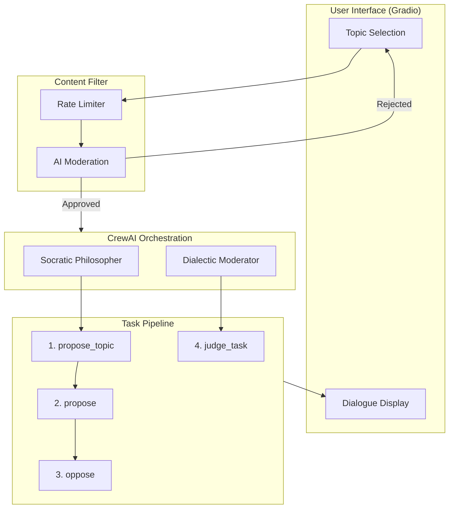
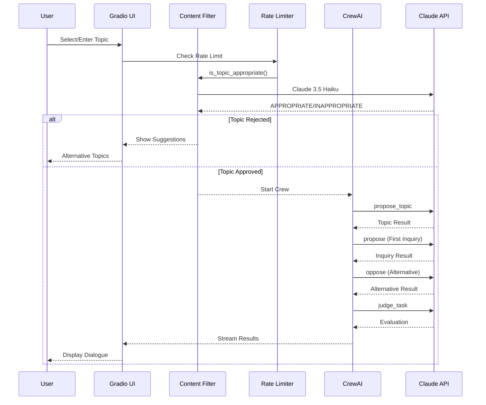
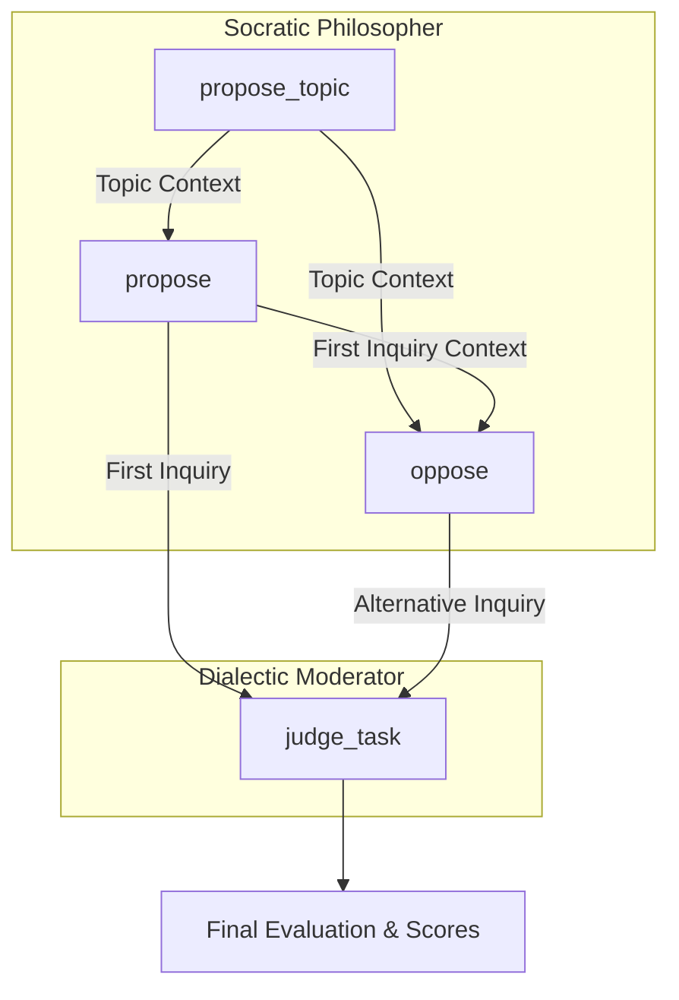
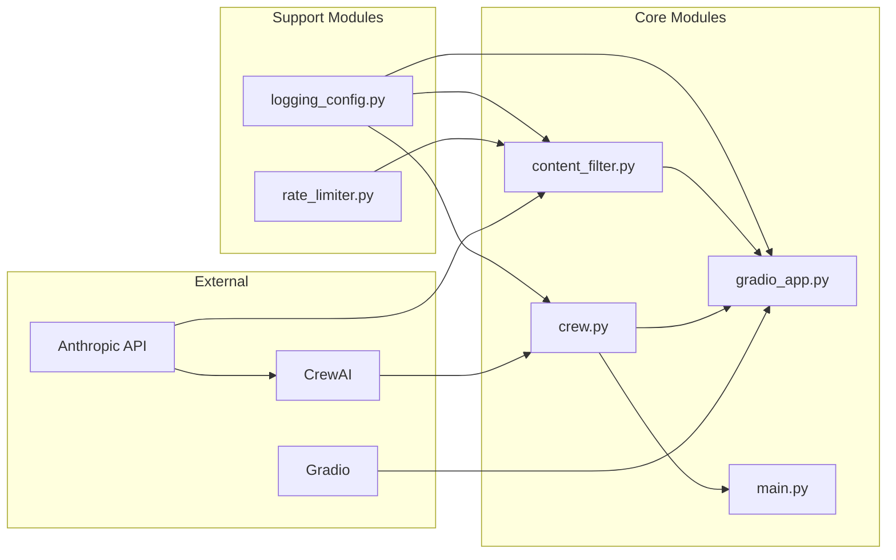
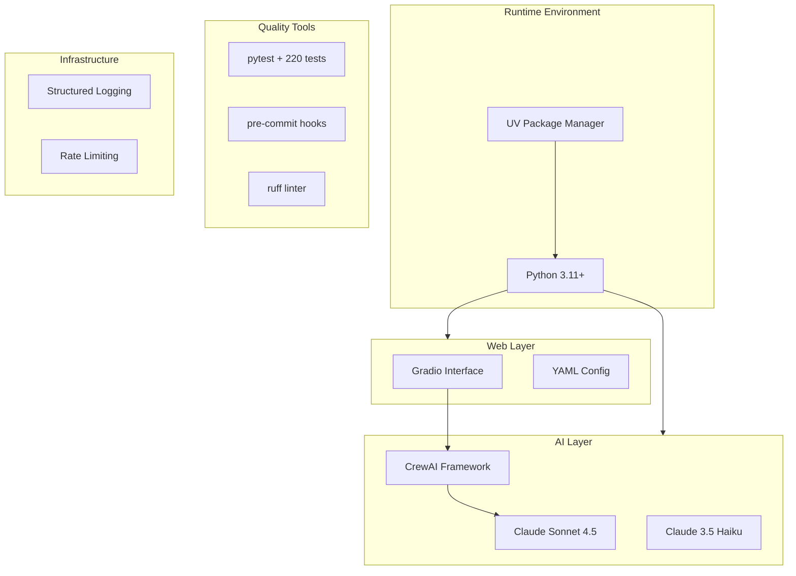
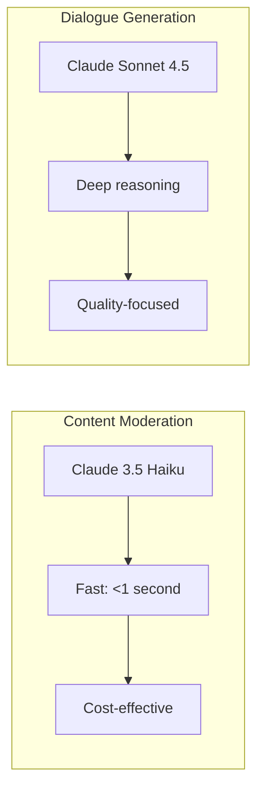
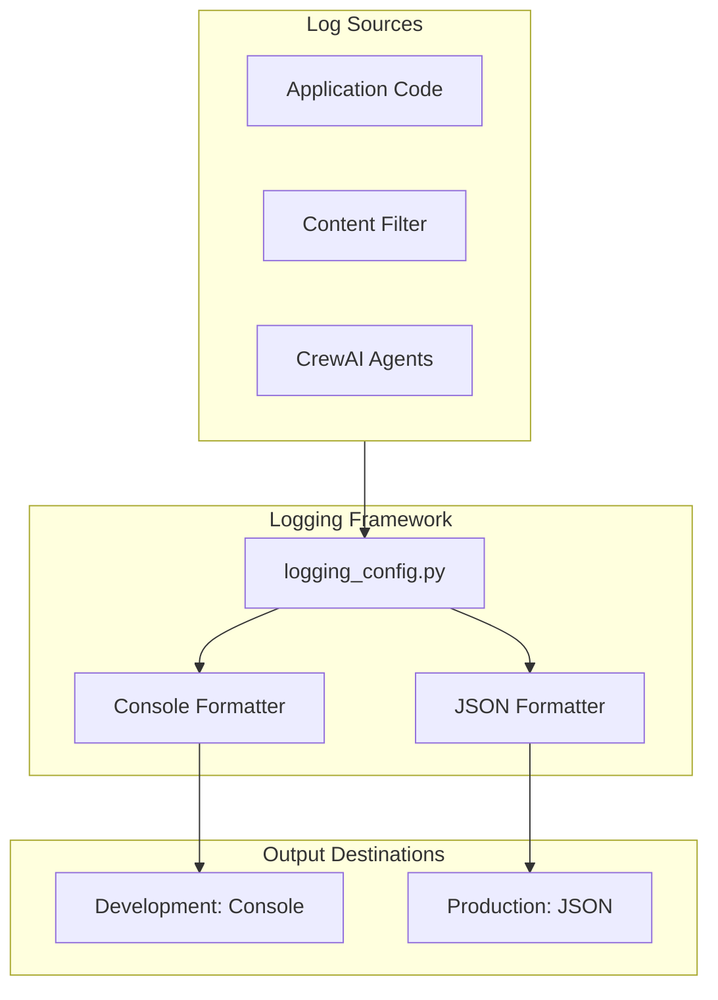
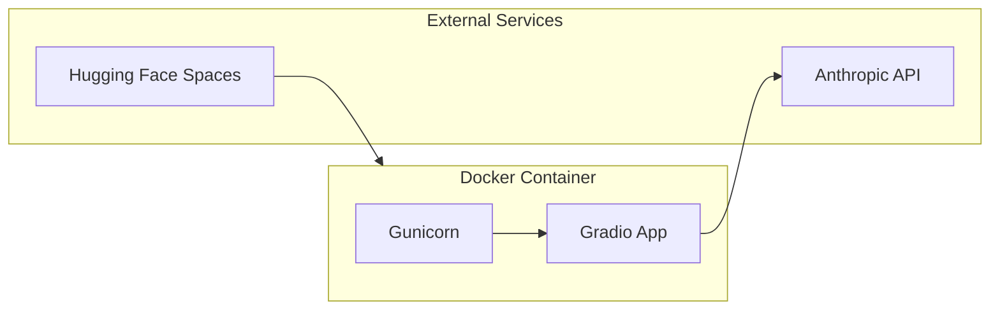
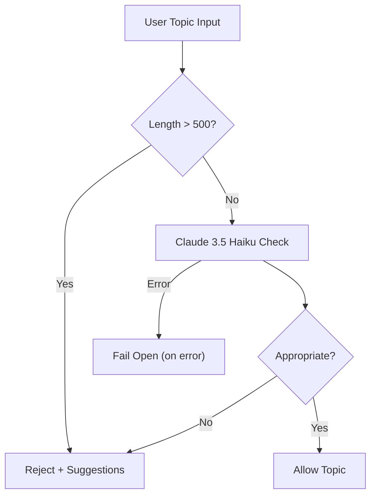

# System Architecture Overview

## Introduction

Socratic Sofa is an AI-powered philosophical dialogue system that implements the Socratic method through multi-agent collaboration. Built on CrewAI and powered by Claude AI, the system generates authentic philosophical inquiry through systematic questioning rather than direct assertions.

## High-Level Architecture



## Data Flow

### Request Flow Diagram



### Task Dependencies



## Component Interactions

### CrewAI Framework

**Process Type**: Sequential

- Tasks execute in strict order
- Each task receives context from previous tasks
- Output from one task becomes input for the next

**Agent Assignment**:

| Task            | Agent                | Purpose                 |
| --------------- | -------------------- | ----------------------- |
| `propose_topic` | Socratic Philosopher | Select/Generate Topic   |
| `propose`       | Socratic Philosopher | First Line of Inquiry   |
| `oppose`        | Socratic Philosopher | Alternative Inquiry     |
| `judge_task`    | Dialectic Moderator  | Evaluate Both Dialogues |

### Module Dependencies



## Technology Stack

### Core Components



### AI Models

| Model             | Purpose             | Characteristics                    |
| ----------------- | ------------------- | ---------------------------------- |
| Claude Sonnet 4.5 | Dialogue generation | Deep reasoning, multi-turn context |
| Claude 3.5 Haiku  | Content moderation  | Fast (<1s), cost-effective         |

### Quality Assurance

| Tool       | Purpose                  |
| ---------- | ------------------------ |
| pytest     | 220+ tests, 99% coverage |
| pre-commit | Automated quality checks |
| ruff       | Linting and formatting   |
| bandit     | Security scanning        |
| vulture    | Dead code detection      |

## Architectural Decisions

### Why Sequential Process?

The Socratic method inherently requires sequential reasoning where each question builds upon previous ones. Sequential processing ensures:

- Logical progression of inquiry
- Context preservation across dialogues
- Proper setup for evaluation phase
- Natural flow matching human philosophical dialogue
- Differentiation between first and second inquiries through context awareness

### Why Two Separate Claude Instances?



### Why Gradio?

- **Rapid Development**: Quick prototype to production
- **Mobile-First**: Responsive out of the box
- **Real-time Updates**: Stream-friendly interface
- **Python Integration**: Seamless with CrewAI
- **Deployment**: Easy Hugging Face Spaces integration

## Performance Characteristics

### Latency Profile

```mermaid
gantt
    title Dialogue Generation Timeline
    dateFormat s
    axisFormat %S

    section Moderation
    Rate Check           :a1, 0, 0.1s
    Content Filter       :a2, after a1, 1s

    section Dialogue
    propose_topic        :b1, after a2, 30s
    propose (5-7 questions) :b2, after b1, 45s
    oppose (5-7 questions)  :b3, after b2, 45s
    judge_task           :b4, after b3, 30s
```



### Resource Usage

| Resource | Expected Usage             |
| -------- | -------------------------- |
| Memory   | ~500MB per dialogue        |
| CPU      | Moderate during generation |
| Network  | Rate-limited API calls     |

## Monitoring & Observability

### Logging Architecture



### Logging Features

- **Context Propagation**: Session IDs, topic context, request metadata
- **Performance Tracking**: Automatic timing for functions and operations
- **Error Details**: Structured exception logging with traceback
- **Log Levels**: DEBUG, INFO, WARNING, ERROR with configurable thresholds

## Deployment Architecture

### Local Development

```bash
python -m socratic_sofa.gradio_app
  → Starts Gradio on 0.0.0.0:7860
  → Reads configurations from config/
```

### Production Deployment



**Environment Requirements**:

- Python 3.11+ runtime
- ANTHROPIC_API_KEY environment variable
- 1GB+ RAM recommended

## Security & Safety

### Content Moderation Flow



### Security Measures

| Layer      | Protection                    |
| ---------- | ----------------------------- |
| Input      | 500 char limit, rate limiting |
| Moderation | AI-powered content filtering  |
| API Keys   | Environment variables only    |
| Output     | Markdown with XSS protection  |

## Future Enhancements

### Planned Features

- **Multi-User Support**: Session-based dialogues, user authentication
- **Dialogue Branching**: Follow-up questions on specific points
- **API Layer**: RESTful API for programmatic access
- **Export Options**: PDF, HTML, plain text formats
